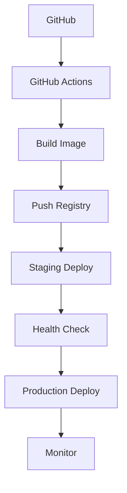

# Personal Landing - 后续迭代路线图

> **当前版本**: v1.0.0 | **最后更新**: 2026-03-16
> **GitHub**: https://github.com/teng00123/personal-landing

---

## 🎯 总体愿景

将Personal Landing打造成为一个**企业级个人品牌展示平台**，具备现代化架构、卓越用户体验和完善的运维体系。

---

## 📈 迭代规划总览

| 迭代 | 代号 | 主题 | 预计周期 | 优先级 | 状态 |
|------|------|------|----------|--------|------|
| **Iter 4** | Performance | 性能优化与监控体系 | 2周 | 🔴 High | 📋 计划中 |
| **Iter 5** | UX-Enhance | 用户体验深度增强 | 3周 | 🟡 Medium | 📋 计划中 |
| **Iter 6** | Security | 安全加固与权限管理 | 2周 | 🔴 High | 📋 计划中 |
| **Iter 7** | DevOps | 部署运维自动化 | 2周 | 🟡 Medium | 📋 计划中 |
| **Iter 8** | Advanced | 高级功能扩展 | 4周 | 🟢 Low | 📋 计划中 |
| **Iter 9** | Mobile | 移动端适配 | 3周 | 🟢 Low | 📋 计划中 |

---

## 🚀 Iteration 4 — Performance (性能优化与监控体系)

### 🎯 目标
提升系统性能，建立完善的监控告警体系

### 📋 功能清单

#### 4.1 前端性能优化
- [ ] **代码分割** - Vue Router懒加载 + 组件异步加载
- [ ] **资源压缩** - 图片压缩、CSS/JS Tree Shaking
- [ ] **缓存策略** - Service Worker + 静态资源CDN
- [ ] **首屏优化** - 关键资源预加载、SSR准备

#### 4.2 后端性能优化
- [ ] **数据库优化** - 索引优化、查询缓存、连接池调优
- [ ] **Redis缓存层** - 热点数据缓存、API响应缓存
- [ ] **异步处理** - 非核心业务异步化
- [ ] **分页优化** - 大数据量分页策略

#### 4.3 监控系统
- [ ] **应用监控** - Prometheus + Grafana仪表板
- [ ] **日志聚合** - ELK Stack (Elasticsearch + Logstash + Kibana)
- [ ] **链路追踪** - Jaeger分布式追踪
- [ ] **性能监控** - APM工具集成 (SkyWalking)

#### 4.4 告警体系
- [ ] **阈值告警** - CPU/内存/磁盘使用率告警
- [ ] **错误告警** - 异常率、响应时间告警
- [ ] **业务告警** - 部署失败、服务不可用告警
- [ ] **通知渠道** - 邮件、钉钉、企业微信集成

### 🛠️ 技术实现
```yaml
# docker-compose.performance.yml
prometheus:
  image: prom/prometheus:v2.40.0
  ports: ["9090:9090"]
grafana:
  image: grafana/grafana:9.0.0
  ports: ["3000:3000"]
elasticsearch:
  image: elasticsearch:8.5.0
  ports: ["9200:9200"]
```

### 📅 里程碑
- **Week 1**: 前端性能优化 + 基础监控
- **Week 2**: 后端优化 + 告警体系搭建

---

## ✨ Iteration 5 — UX-Enhance (用户体验深度增强)

### 🎯 目标
打造极致用户体验，提升用户满意度和留存率

### 📋 功能清单

#### 5.1 界面体验升级
- [ ] **主题系统** - 深色/浅色/自动切换 + 自定义主题
- [ ] **动画效果** - 页面切换、数据加载、交互动画
- [ ] **响应式设计** - 完美适配各种屏幕尺寸
- [ ] **无障碍访问** - WCAG 2.1 AA级别合规

#### 5.2 交互体验优化
- [ ] **智能搜索** - 全文检索 + 模糊匹配 + 搜索建议
- [ ] **个性化推荐** - 基于用户行为的文章推荐
- [ ] **实时通知** - WebSocket推送系统消息
- [ ] **快捷操作** - 键盘快捷键、右键菜单

#### 5.3 内容体验增强
- [ ] **富文本编辑器** - 支持图表、数学公式、流程图
- [ ] **多媒体支持** - 视频嵌入、音频播放器
- [ ] **社交分享** - 一键分享到各大社交平台
- [ ] **评论系统** - 访客评论、回复通知

#### 5.4 数据分析
- [ ] **用户行为分析** - 热力图、点击流分析
- [ ] **内容效果分析** - 阅读完成率、停留时间
- [ ] **性能分析报告** - 自动生成性能报告

### 🎨 设计系统
```scss
// 设计令牌
$colors: (
  primary: #3b82f6,
  secondary: #64748b,
  success: #10b981,
  warning: #f59e0b,
  danger: #ef4444
);

$spacing: (
  xs: 0.25rem,
  sm: 0.5rem,
  md: 1rem,
  lg: 1.5rem,
  xl: 2rem
);
```

### 📅 里程碑
- **Week 1-2**: 界面升级 + 交互优化
- **Week 3**: 内容增强 + 数据分析

---

## 🔒 Iteration 6 — Security (安全加固与权限管理)

### 🎯 目标
建立企业级安全防护体系，保障数据和系统安全

### 📋 功能清单

#### 6.1 身份认证升级
- [ ] **多因子认证** - TOTP + SMS + 邮箱验证
- [ ] **OAuth 2.0** - GitHub、Google、微信登录
- [ ] **单点登录** - SAML 2.0集成
- [ ] **API限流** - 基于IP/用户的请求限制

#### 6.2 权限管理
- [ ] **RBAC权限模型** - 角色基础访问控制
- [ ] **细粒度权限** - 功能级、数据级权限控制
- [ ] **权限审计** - 权限变更日志记录
- [ ] **临时权限** - 限时访问授权

#### 6.3 数据安全
- [ ] **数据脱敏** - 敏感信息自动脱敏
- [ ] **加密存储** - 数据库字段级加密
- [ ] **备份加密** - 自动备份数据加密
- [ ] **传输加密** - 强制HTTPS + 证书管理

#### 6.4 安全防护
- [ ] **WAF集成** - Web应用防火墙
- [ ] **恶意检测** - SQL注入、XSS攻击检测
- [ ] **漏洞扫描** - 定期安全扫描
- [ ] **应急响应** - 安全事件处理流程

### 🔐 安全配置
```yaml
# security.yml
jwt:
  algorithm: RS256
  expiration: 3600
oauth:
  providers:
    - github
    - google
    - wechat
rate_limit:
  window: 900  # 15分钟
  max_requests: 100
```

### 📅 里程碑
- **Week 1**: 认证升级 + 权限管理
- **Week 2**: 数据安全 + 防护体系

---

## 🛠️ Iteration 7 — DevOps (部署运维自动化)

### 🎯 目标
实现全自动CI/CD流水线，提升部署效率和可靠性

### 📋 功能清单

#### 7.1 CI/CD流水线
- [ ] **GitHub Actions** - 自动化测试、构建、部署
- [ ] **多环境部署** - Dev/Staging/Production环境
- [ ] **蓝绿部署** - 零停机时间部署
- [ ] **回滚机制** - 一键快速回滚

#### 7.2 基础设施即代码
- [ ] **Terraform** - 云资源管理
- [ ] **Ansible** - 配置管理自动化
- [ ] **Docker Swarm** - 容器编排
- [ ] **Kubernetes** - 容器集群管理（可选）

#### 7.3 运维自动化
- [ ] **自动扩缩容** - 基于负载的自动扩缩容
- [ ] **健康检查** - 服务健康状态监控
- [ ] **日志轮转** - 自动化日志管理
- [ ] **证书续期** - SSL证书自动续期

#### 7.4 灾备恢复
- [ ] **多地备份** - 异地数据备份
- [ ] **灾难恢复** - 自动化灾难恢复流程
- [ ] **数据同步** - 实时数据同步机制

### 🚢 部署架构


### 📅 里程碑
- **Week 1**: CI/CD流水线 + IaC
- **Week 2**: 运维自动化 + 灾备恢复

---

## 🌟 Iteration 8 — Advanced (高级功能扩展)

### 🎯 目标
添加高级功能，提升平台竞争力

### 📋 功能清单

#### 8.1 AI功能集成
- [ ] **智能写作助手** - AI辅助文章创作
- [ ] **内容摘要** - 自动生成文章摘要
- [ ] **标签推荐** - AI自动推荐文章标签
- [ ] **代码审查** - AI代码质量检查

#### 8.2 多媒体功能
- [ ] **在线IDE** - 浏览器内代码编辑运行
- [ ] **直播功能** - 技术分享直播集成
- [ ] **播客支持** - 音频内容管理
- [ ] **视频教程** - 视频课程管理

#### 8.3 社区功能
- [ ] **关注系统** - 用户关注、粉丝管理
- [ ] **点赞收藏** - 内容互动功能
- [ ] **私信系统** - 用户间消息通信
- [ ] **活动管理** - 线上/线下活动组织

#### 8.4 商业化功能
- [ ] **付费专栏** - 会员制内容付费
- [ ] **打赏功能** - 读者打赏支持
- [ ] **广告系统** - 精准广告投放
- [ ] **电商集成** - 周边商品销售

### 🤖 AI集成示例
```python
# ai_service.py
from openai import OpenAI

class AIService:
    def generate_summary(self, content: str) -> str:
        # AI生成摘要
        pass
    
    def recommend_tags(self, content: str) -> list:
        # AI推荐标签
        pass
```

### 📅 里程碑
- **Week 1-2**: AI功能 + 多媒体
- **Week 3-4**: 社区功能 + 商业化

---

## 📱 Iteration 9 — Mobile (移动端适配)

### 🎯 目标
完善移动端体验，覆盖全终端用户

### 📋 功能清单

#### 9.1 移动端适配
- [ ] **PWA支持** - 渐进式Web应用
- [ ] **原生APP** - React Native或Flutter开发
- [ ] **小程序** - 微信/支付宝小程序
- [ ] **移动优化** - 触摸优化、手势支持

#### 9.2 移动专属功能
- [ ] **推送通知** - 移动端消息推送
- [ ] **离线支持** - 离线内容访问
- [ ] **相机集成** - 拍照上传、扫码功能
- [ ] **地理位置** - 基于位置的服务

### 📅 里程碑
- **Week 1-2**: PWA + 移动优化
- **Week 3**: 原生APP开发

---

## 📊 成功指标

### 技术指标
- **性能**: 首屏加载 < 2s，API响应 < 200ms
- **可用性**: 99.9% uptime
- **扩展性**: 支持10万+用户访问
- **安全性**: 零高危漏洞

### 业务指标
- **用户满意度**: > 4.5/5.0
- **内容产出**: 月均10篇高质量文章
- **项目部署**: 成功率 > 95%
- **社区活跃**: 日活用户 > 1000

---

## 🔄 迭代管理

### 开发流程
1. **需求评审** - 每迭代开始前需求确认
2. **技术方案** - 详细技术设计和评审
3. **开发实现** - 敏捷开发，两周一个sprint
4. **测试验收** - 自动化测试 + 人工验收
5. **部署上线** - 灰度发布 + 全量上线
6. **回顾优化** - 迭代回顾和经验总结

### 风险控制
- **技术风险**: 新技术预研、PoC验证
- **进度风险**: 每周进度跟踪、风险预警
- **质量风险**: 代码review、自动化测试
- **资源风险**: 人员备份、外部依赖评估

---

## 📞 联系与支持

- **项目负责人**: teng00123
- **技术讨论**: GitHub Issues
- **邮件联系**: teng00123@github.com
- **项目文档**: [GitHub Wiki](https://github.com/teng00123/personal-landing/wiki)

---

<div align="center">

**🚀 让我们一起打造卓越的个人品牌展示平台！**

⭐ 如果这个项目对您有帮助，请给它一个星标！

</div>